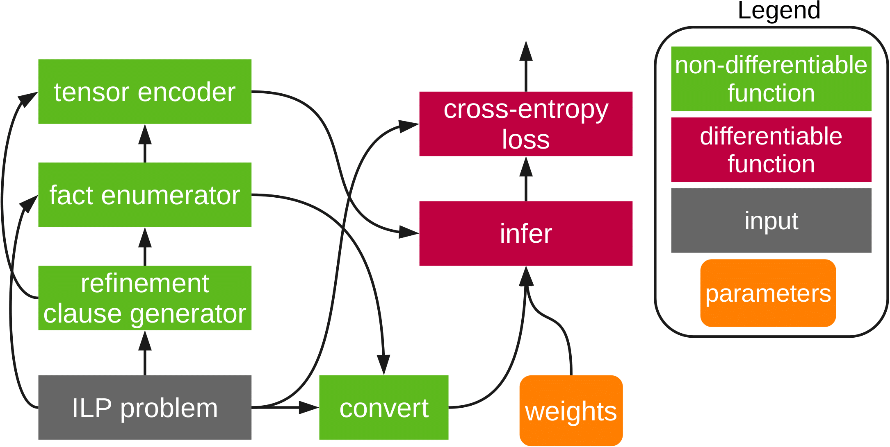

# Differentiable ILP for Structured Examples

An implementation of the paper: Differentiable Inductive Logic Programming for Structured Examples
 


# Requirement
* python >= 3.6.3 


See requirements.txt for more details.

# Installation
```bash
pip install -r requirements.txt
```


# How to use

### DEMO
A simple demonstration is available in [demo.ipynb](demo.ipynb).

Or on the terminal,
```bash
python -m experiments [type] [name] [lr] [epoch] [m:target program size] [T:infer_step] [--nosie_rate]
```
* [type]: normal, noise, step, softor
* [name]: member, plus, append, delete, subtree


For example,
```console
python -m experiments normal member 1e-2 3000 2 4 --noise_rate 0.05
python -m experiments normal plus 1e-2 3000 3 8 --noise_rate 0.05
python -m experiments normal append 1e-2 3000 3 4 --noise_rate 0.05
python -m experiments normal delete 1e-2 3000 2 4 --noise_rate 0.05
python -m experiments normal subtree 1e-2 3000 3 4 --noise_rate 0.05
```


### Experiments

For the noise experiments, for example,
```bash
python -m experiments noise member 1e-2 3000 2 4
```
The results are summarized in `imgs` folder.


For the clause-generation experiments, for example,
```bash
python -m experiments step delete 1e-2 3000 2 4
```
The results are summarized in `imgs` folder.


For the soft program-composition experiments, for example,
```bash
python -m experiments softor append 1e-2 3000 3 4
```
The results are summarized in `results` folder.
